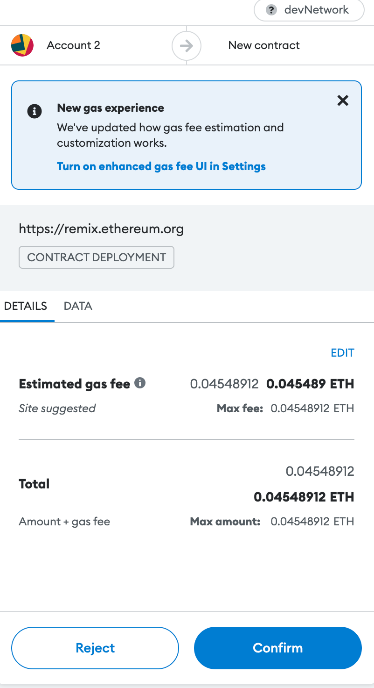

# KaseiCoin-module-4-Challenge
## Evaluation Evidence

### KaseiCoin.sol Compiled

### KasieCoinCrowdsale.sol Compiled

## Screenshots for deploying the Crowdsale

### 1. Deploy the crowdsale with Remix, MetaMask, and Ganache.

#### Beneficial Address

#### Investor Address

#### Accounts on Ganache

### 2. Deploy contracts 
#### Metamask asks to confirm the transaction

#### Contract deployed

#### KaseiCoinCrowdsale and KaseiCoin added to remix

### 3. Test to buy 10 Tokens
#### Metamask asks to confirm the transaction

#### Investor account balance 10, total supply 10 tokens

#### Wei raised 10

